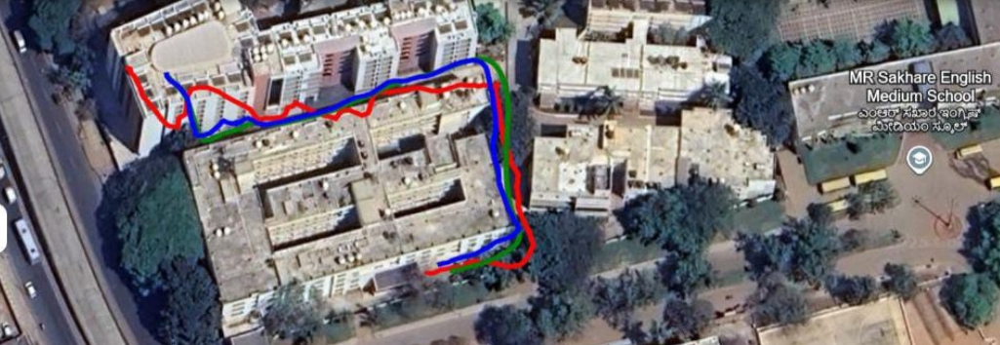

# -IMU-data-acquisition-and-sensor-fusion
A project focused on IMU data acquisition and sensor fusion techniques for reliable orientation and motion estimation.
This project focuses on acquiring data from low-cost sensors — MPU9250 (IMU), HMC5883L (magnetometer), and NEO-6M (GPS) — and applying an Extended Kalman Filter (EKF) for sensor fusion. It aims to enhance motion tracking accuracy by overcoming individual sensor limitations such as drift (IMU) and signal loss (GPS).

#Project Objective
Acquire real-time sensor data from MPU9250, HMC5883L, and NEO-6M
Calibrate the sensors to eliminate bias and offset
Implement EKF for fusing accelerometer, gyroscope, magnetometer, and GPS data
Estimate accurate position, velocity, and orientation in real-time
Hardware Components
MPU9250 – 3-axis accelerometer + 3-axis gyroscope
HMC5883L – 3-axis magnetometer
NEO-6M – GPS module
Raspberry Pi – for data acquisition and processing
Sensor Calibration
To improve accuracy, sensors are calibrated before data fusion:

Accelerometer & Gyroscope: Offset is calculated using the average of 500 samples.
Magnetometer: Offset is derived by rotating the sensor in all directions and averaging the readings over 10 seconds.
Sensor Fusion (Extended Kalman Filter)
An EKF is used to:

Predict the state (position, velocity, yaw) using IMU data
Correct the prediction using GPS measurements
Apply yaw correction using magnetometer data
State Vector
x, y – position
vx, vy – velocity
yaw – orientation angle
EKF Flow
Read raw sensor values
Convert GPS (latitude, longitude) to UTM (meters)
Predict motion state from accelerometer and gyroscope
Update the state with GPS data
Apply yaw correction using magnetometer
Save and export the filtered result
image
Output and Accuracy
## Output and Accuracy

* **Red Path** – GPS logger path (phone)
* **Blue Path** – Raw sensor path (MPU9250 + NEO-6M + HMC5883L)
* **Green Path** – EKF output (filtered path)

Average error between raw GPS and EKF output: **5.13 meters**

---

## Dataset

* Raw sensor data logs (CSV) – [Download](https://drive.google.com/yourlink)
* Filtered EKF output – [Download](https://drive.google.com/yourlink)
* GPS logger reference data – [Download](https://drive.google.com/yourlink)

---

## Applications

* Real-time motion tracking for robots and autonomous vehicles
* Precision agriculture and asset tracking
* Drone localization in GPS-denied environments

WhatsApp Image 2025-05-29 at 00 14 04_59c62846

WhatsApp Image 2025-05-13 at 23 51 43_ce382a1a

Result
WhatsApp Image 2025-05-03 at 21 07 22_f3f3632b
